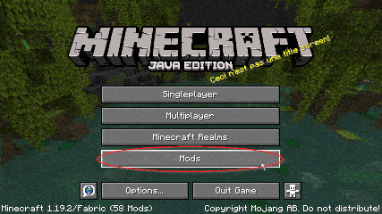

# mInetiface
**mInetiface** is a **Minecraft Fabric** mod that allows to connect to an **Intiface Central** server and thus control a connected sextoy

## Score system
There is a hidden score system that allows to compute toy intensity. There are 4 independent scoring systems, one for each of the following categories : Attack, Mining, Experience, Masochist.

The intensity is then calculated by taking the highest score from the 4 categories.

## Ingame config
You have the possibility to configure the Intiface server address, the score system and the HUD with the ingame mod config

## What do you need to use this mod ?
1. **Minecraft (Java Edition)**
2. **Intiface Central** [https://intiface.com/central/](https://intiface.com/central/)
3. One or multiple supported device(s) : [IoST Index – Vibrators with Buttplug.io Support](https://iostindex.com/?filter0ButtplugSupport=4&filter1Features=OutputsVibrators)

## How to install the mod
1. Download and install [Minecraft Launcher](https://www.minecraft.net/en-us/download)
2. Download Fabric [https://fabricmc.net/use/installer/](https://fabricmc.net/use/installer/)
   1. Run the installer
   2. On the client tab select the Minecraft Version and click install
3. Run the Minecraft Launcher. Select the new profile named **fabric-loader-xxx**
   1. Select the **Installations** tab and click the folder icon next to the profile **fabric-loader-xx**
   2. Create **mods** folder if it doesn't exists. Example : **C:\\Users\\<username>\\AppData\\Roaming\\.minecraft\\mods**
4. Next and final step is to download all **JAR** files and put them into the **mods** folder
   1. Download [Fabric API](https://www.curseforge.com/minecraft/mc-mods/fabric-api/files/4474468) and place the jar in **mods** folder
   2. Download [Mod Menu](https://www.curseforge.com/minecraft/mc-mods/modmenu/files/4441645) and place the jar in **mods** folder
   3. Download [mInetiface](https://github.com/Fyustorm/mInetiface/releases/download/1.19.4/minetiface-1.0.0-1.19.4.jar) and place the jar in **mods** folder
   
## How to use
1. Make sure you have installed the mod and Intiface Central
2. Run the Intiface Central and start the server
3. Run the game
4. Use the command /minetiface-connect in the Minecraft chat
5. Have fun !

## Credits
This project is based on [minegasm](https://minegasm.therainbowville.com) and [Minegasm-fabric](https://github.com/vinceh121/Minegasm-fabric)
